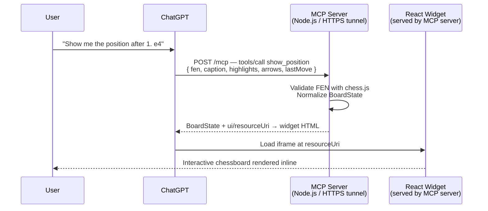

# blunder-lens

Give ChatGPT a chessboard — and a better view of your blunders.

`blunder-lens` is a private ChatGPT app for visualizing chess positions inside ChatGPT conversations.

The goal is not to build a full chess platform. The goal is to let ChatGPT discuss chess while a real board follows the conversation.

## Status

Working vertical slice. Private development app.

The `show_position` MCP tool is live and renders an interactive chessboard inline in ChatGPT responses.

## How it works



The server is **stateless** — every `show_position` call contains all information needed to render the board. No hidden game state is kept between calls.

## Architecture

```
shared/          Shared TypeScript types (BoardState, Square, etc.)
server/          Node.js MCP server — validates input, normalizes FEN, serves widget
web/             React + Vite widget — renders the chessboard inside a ChatGPT iframe
```

### Data flow

1. ChatGPT calls `show_position` with optional `fen`, `orientation`, `caption`, `highlights`, `arrows`, and `lastMove`.
2. The server validates the FEN with `chess.js` and normalizes it to a `BoardState`.
3. The tool response includes the structured `BoardState` and a `ui/resourceUri` pointing to the widget HTML.
4. ChatGPT loads the widget in an inline iframe.
5. The widget reads the board state from `window.__BOARD_STATE__` and renders the board.

## Stack

| Layer | Technology |
|---|---|
| Language | TypeScript throughout |
| Server | Node.js, `@modelcontextprotocol/sdk` |
| Widget | React, Vite |
| Chess rules | chess.js |
| Validation | Zod |
| Tunnel | Microsoft Dev Tunnel (local HTTPS) |

## Repo structure

```
blunder-lens/
├── shared/          # BoardState types shared between server and widget
│   └── src/
│       └── board-state.ts
├── server/          # MCP server (Node.js)
│   └── src/
│       ├── index.ts            # HTTP server, MCP setup, static file serving
│       └── tools/
│           └── show-position.ts  # show_position tool logic
└── web/             # React + Vite chessboard widget
    └── src/
        ├── App.tsx
        └── ChessBoard.tsx
```

## Getting started

### Prerequisites

- Node.js 20+
- A [Microsoft Dev Tunnel](https://learn.microsoft.com/en-us/azure/developer/dev-tunnels/overview) for local HTTPS (required by ChatGPT)

### Install

```bash
npm install
```

### Build

```bash
npm run build
```

This builds `shared`, then `server`, then `web` in order.

### Run the server

```bash
node server/dist/index.js
```

The server starts on port `8787` by default. Override with `PORT=<n>`.

### Configure the tunnel

Expose the server over HTTPS:

```bash
devtunnel host -p 8787 --allow-anonymous
```

Set the public URL in `server/.env`:

```env
PORT=8787
PUBLIC_BASE_URL=https://<your-tunnel-id>.euw.devtunnels.ms
```

### Connect ChatGPT

In ChatGPT Developer Mode, create a custom app pointing to:

```
https://<your-tunnel-id>.euw.devtunnels.ms/mcp
```

Ask ChatGPT to show a position. For example:

> Show the position after 1. e4 with an arrow from e2 to e4.

## The `show_position` tool

### Input

All fields are optional. Omit `fen` to show the starting position.

```jsonc
{
  "fen": "rnbqkbnr/pppppppp/8/8/4P3/8/PPPP1PPP/RNBQKBNR b KQkq - 0 1",
  "orientation": "white",          // "white" | "black"
  "caption": "After 1. e4.",
  "highlights": ["e4", "d5"],
  "arrows": [{ "from": "e2", "to": "e4", "label": "1.e4" }],
  "lastMove": { "from": "e2", "to": "e4" }
}
```

### Output

A normalized `BoardState`. Invalid FEN is rejected with an error.

```jsonc
{
  "fen": "rnbqkbnr/pppppppp/8/8/4P3/8/PPPP1PPP/RNBQKBNR b KQkq - 0 1",
  "orientation": "white",
  "caption": "After 1. e4.",
  "highlights": ["e4", "d5"],
  "arrows": [{ "from": "e2", "to": "e4", "label": "1.e4" }],
  "lastMove": { "from": "e2", "to": "e4" }
}
```

## Development

```bash
npm run typecheck   # type-check all workspaces
npm run build       # build all workspaces
npm run dev         # watch mode for server + web (requires concurrently)
```

## Non-goals (v0)

- Public app directory submission
- User accounts / authentication
- Database or persistence
- Stockfish / engine analysis
- PGN parsing
- Game-playing mode
- Multiple boards / variation tree / move navigation
- Drag-and-drop moves
- Production deployment

## State model

`blunder-lens` is stateless by design.

The ChatGPT conversation owns the pedagogical flow.
The user owns choices and intent.
The app renders one board state per call.
The MCP server validates and normalizes input, but never maintains a hidden current board between calls.

**The FEN is authoritative.**

## Development tunnel

During development, expose the local MCP server using Microsoft Dev Tunnel.

The ChatGPT Developer Mode app points to the public HTTPS tunnel URL for the MCP endpoint.

Do not commit tunnel URLs or machine-specific values to the repository.
